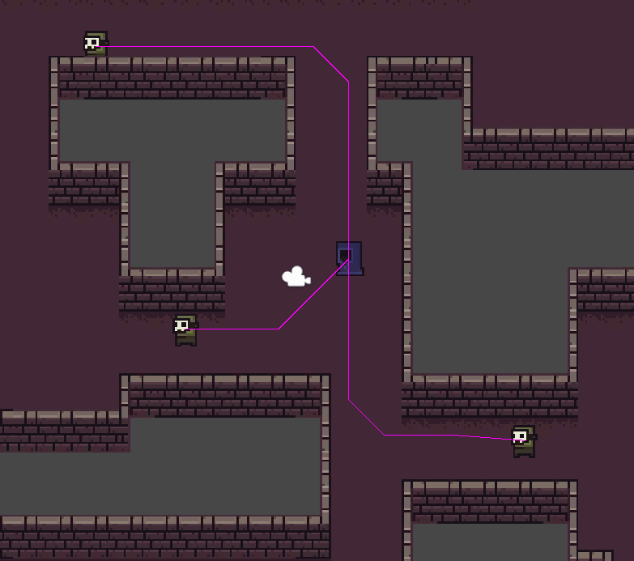

# tilemapPathfinding
A* pathfinding in Unity integrated with Tilemap
 
 How to run:
 - clone or download the repo
 - open [TilemapAStar](TilemapAStar) in Unity 2019.4.18f1 or later
 - open "small level" scene, in the scene's folder and press play

Made using [a sprite pack from itch.io](https://0x72.itch.io/16x16-dungeon-tileset)
 
## Tilemap and Pathfinding

I make a lot of things in 2D in Unity and a conspicuously absent part of Unity Engine is an implementation of any kind of 2D pathfinding. In the past I had borrowed other people’s public implementations for pathfinding, but after I’d learned about several ways to do this in my coursework, I was eager to make this for myself. I also saw that the Unity Tilemap system has the potential to be an amazing tool to handle some aspects of this system. So i decided to make a novel implementation to A* and Djikstra’s pathfinding by using it in conjunction with the Unity Tilemap system.



## Working with Tilemap

For the tilemap portion of this, I wanted the ability to set up the environment using tilemap and be able to use that to figure out what tiles are walkable. I found there could be many ways to do this, for my implementation I have a multi-tilemap setup where one tilemap designates the walkable area (any cell with a tile is walkable) and other tilemaps are used for the remainder of the environment. My implementation would also work perfectly with a separate, invisible, tilemap that is only used for pathfinding, but that's more work and needs to be updated separately. You could make adjustments to my system to make it work with one tilemap filled with scriptable objects, but that would be more useful in a system that requires edge weights, for varying terrain.


## A* and Djikstra's Algorithms

In A* pathfinding we want to find a path between a start and goal across a graph of nodes. The algorithm intelligently searches outward from explored nodes by using a cost function to determine which node to explore next. This cost function is a combination of the cost of the path up to that node and a heuristic that guesses how close it is to the goal (usually straight line distance). Here I’m storing the path as a child-parent relationship, adjusting nodes’ parents as it loops through them, until the goal node is reached. This is done in such a way that the goal node's parent is the last node on the path, that node's parent is the 2nd last node on the path, and the nth parent is the nth last node on the path.

*Snippet from [Pathfinder.cs](TilemapAStar/Assets/Scripts/Pathfinder.cs)*

```C#
public void AStar(Node start, Node goal, System.Action> callback){//return a path on the grid to the callback, from start to goal
    MinHeap openSet = new MinHeap(30);//nodes that are to be looked at
    //per node variable that are not needed after search
    Dictionary gCost = new Dictionary();//cost of the current best path to the node. gcost = parent.gcost + distance(parent, node)
    Dictionary parent = new Dictionary();//parent with the smallest gCost
    
    //initialize start node
    gCost[start] = 0;
    start.cost = Heuristic(start, goal);//fCost = gCost (actual Path) + hCost (estimated distance to goal)
    openSet.Insert(start);

    while(openSet.Count != 0){
        //find the node with the lowest fcost
        Node current = openSet.Peek();//using a heap here gives O(1) look up
        
        if (current == goal){//if we've reached the end
            callback(TracePath(current, parent));//return the path
            return;
        }
        
        openSet.Remove();
        //loop thorugh neighbors of the current node
        foreach(Node neighbor in current.neighbors){
            //see what the cost to get to this neighbor through current would be. Current cost plus cost to get to neighbor. 
            float dist = Vector3.Distance(current.posWorld, neighbor.posWorld);//returns 1 for straight and 1.5 for corners.
            float gCostTest = gCost[current] + dist;//find the gcost through current
            if (!gCost.ContainsKey(neighbor) || gCostTest < gCost[neighbor]){//if this is a better path than this node has, make this its parent
                parent[neighbor] = current;
                gCost[neighbor] = gCostTest;
                neighbor.cost = gCost[neighbor] + Heuristic(neighbor,goal);//fCost
                if (!openSet.Contains(neighbor))
                    openSet.Insert(neighbor);//new node will be inserted and sorted up
                else
                    openSet.UpdateUp(neighbor);//update the node position in the heap since its compare value changed
            }
        }
    }
    Debug.Log("No path between start and end");
}
```

While I was implementing A* pathfinding, I decided to document how it ran at varying stages of optimization. I first made a very basic version of A*, that didn’t even use a heap, as that's the only data structure used in this algorithm that isn't built into C#. Then I implemented the Heap, so it could find the lowest cost node faster, which is called for each time it looks at a new node. This ran about 26% faster than without the heap. Next I wanted to make an optimization with finding neighbors. The implementation was spending a lot of time finding out which nodes are neighbors to another node, but it's not like they are moving. So I set it up to calculate the once at the start, and that made it an additional 23% faster.

So far throughout this process I had been testing it by running one random walkable point to another random point, and this implementation does reasonably fast (several hundred times a second). However most of the paths needed in a game are to or from a player, who only moves to a new tile every so often. In this case you could run a pathfinding algorithm once, across the entire grid (or subgrid) and set up parentage of nodes so that you could trace a path child to parent all the way to the player’s node, without running any real calculations. I implemented this using Djikstra’s algorithm, as the advantage of A* is that it doesn’t need to explore as many nodes, but we want to explore all of them. The results showed that running this to find only one path was about twice as slow, but paths found after the first are so fast that over 1000 paths it took 99.6% less time than a fully optimized A*, which was so large a difference it was outside of the significant figures to which I could accurately measure.

*Execution Times of Pathfinding Functions*
|               | 1 path | 100 paths | 1000 paths | average (ms) |
| ------------- | ------------- | ------------- | ------------- | ------------- |
| Unoptimized A*  | 0.0024s  | 0.18s  | 1.5s  | 1.5ms  | 
| A* with a Heap  | 0.0057s  | 0.13s  | 1.1s  | 1.1ms  | 
| A* with preloaded neighbors  | 0.0044s  | 0.090s  | 0.84s | 0.84ms  | 
| Dijkstra's to a single goal  | 0.0080s  | 0.00036s  | 0.0031s  | 	0.0031ms  | 

So why use A* at all? Why bother Implementing it? Dijkstra's Algorithm is only better in this narrow case. That 3.1μs average path trace is only good after the 8ms first run of Dijkstra's has taken place. Any time there is a path needed that is not to or from the player (or other common goal) A* is much faster. This implementation of Dijkstra’s does not terminate until it’s explored all of the walkable nodes, which gives up every advantage that A* has to make it so fast. It needs to do this to create the proper parent structure so that you can trace a path from any node to the goal.

This does introduce another problem with this particular implementation of Dijkstra’s versus A*. On very large tilemaps, Djikstra’s time to set up parents could skyrocket. It needs to run every time a player (or goal) moves to a new node. This isn’t a problem I encountered on this project, but it would be relatively easy to implement here. Since it’s a breadth-first search that’s always looking at the lowest path cost node (effectively a circle without terrain weights), it could be easily depth-limited by returning after reaching a certain path cost. It would then need pathfinding agents to use A* for their long trips if they are outside of the area Djikstra’s explored.

*Snippet from [Pathfinder.cs](TilemapAStar/Assets/Scripts/Pathfinder.cs)*

```C#
void Dijkstra(Node source){//creates a parent structure that can be traced to find a path to one location (the player)
    MinHeap openSet = new MinHeap(30);//nodes that are to be looked at
    HashSet touched = new HashSet();//nodes contained have had their costs set. Alternative to resetting all the costs

    //initialize start node
    source.cost = 0;//cost of the current best path to the node. gcost = parent.gcost + distance(parent, node)
    source.parent = null;
    touched.Add(source);
    openSet.Insert(source);

    while(openSet.Count != 0){
        //find the node with the lowest cost
        Node current = openSet.Peek();//using a heap here gives O(1) look up
        openSet.Remove();

        //loop thorugh neighbors of the current node
        foreach(Node neighbor in current.neighbors){
            //see what the cost to get to this neighbor through current would be. Current cost plus cost to get to neighbor. 
            float dist = Vector3.Distance(current.posWorld, neighbor.posWorld);//returns 1 for straight and 1.5 for corners.
            float costTest = current.cost + dist;//find the gcost through current
            if (!touched.Contains(neighbor) || costTest < neighbor.cost){//if this is a better path than this node has, make this its parent
                neighbor.parent = current;
                neighbor.cost = costTest;
                touched.Add(neighbor);
                if (!openSet.Contains(neighbor))
                    openSet.Insert(neighbor);//new node will be inserted and sorted up
                else
                    openSet.UpdateUp(neighbor);//update the node position in the heap since its compare value changed
            }
        }
    }
}
```

## Takeaways

I took on this project in my spare time in my senior year at Kent State. It was really fun to be able to apply a lot of things I’d learned and tackle a subject that seemed intimidating before I started my degree. It is cool to see this interacting with the tilemap system, which opens up some interesting workflow possibilities. I’m glad I decided to measure the timings on different versions of the algorithm, it was enlightening on how much time I’m really saving, and showed how optimal a combination of Djikstra’s and A* can be.

This is one project I see myself actually revisiting in the future. I make games that often need this kind of pathfinding, and in any kind of large project I can see additions I’d like to make. I would certainly want to depth-limit the Djikstra’s, as I mentioned before. I read that you can use scriptable objects to encode data in tile map tiles like weights for difficult terrain, and other things; that would be nice to have available to me.
